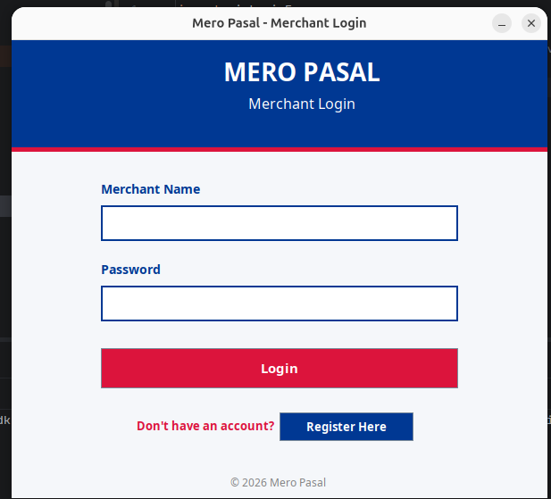
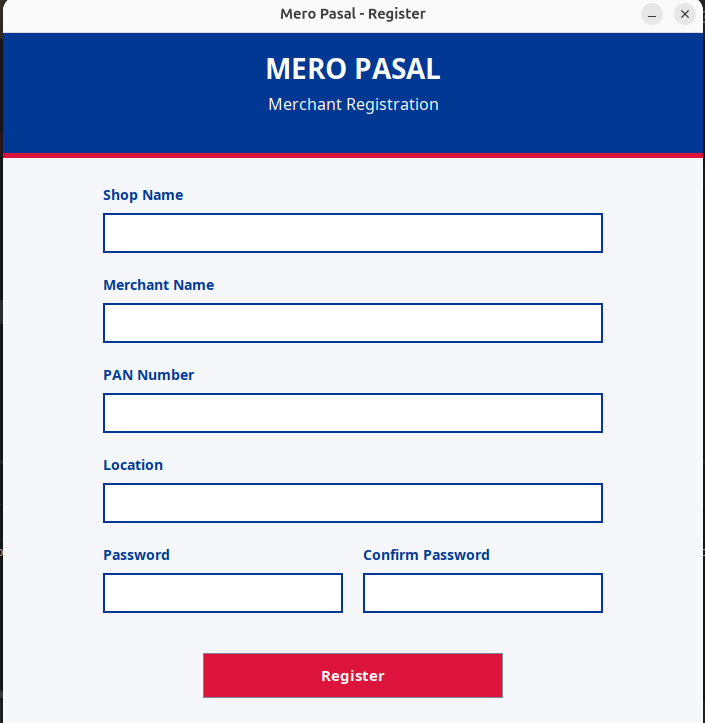
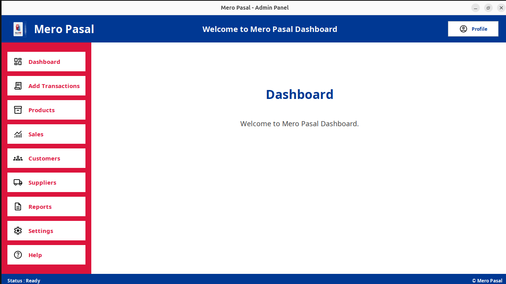

# 🛍️ Mero Pasal

**Mero Pasal** is a Java-based desktop application developed to simplify shop management for small and medium-sized businesses. It provides an intuitive graphical user interface built with Java Swing, enabling users to manage products, customers, suppliers, sales, and transactions from a single dashboard.

---

## ✨ Features

* 📊 Interactive Dashboard
* 💳 Transaction Management
* 📦 Product Management
* 💰 Sales Management
* 👥 Customer Management
* 🚚 Supplier Management
* 📑 Reports
* ⚙️ Settings
* ❓ Help Section
* 🎨 Modern Nepal-themed UI (Red & Blue)

---

## 🖥️ Screenshots

## 📸 Screenshots

### Login Page



### Registration Page



### Dashboard



### Products

>'Yet to be added'

---

## 🛠️ Technologies Used

* Java
* Java Swing
* IntelliJ IDEA
* Object-Oriented Programming (OOP)
* MYSQL
* DBeaver

---

## 📂 Project Structure

```text
Pasal/
│
├── src/
│   ├── ui/
│   │   ├── Dashboard.java
│   │   ├── LoginFrame.java
│   │   ├── RegisterFrame.java
│   │   └── ...
│   │
│   └── images/
│       ├── logo.png
│       ├── profile.png
│       ├── dashboard.png
│       ├── product.png
│       └── ...
│
└── README.md
```

---

## 🚀 Getting Started

### Clone the Repository

```bash
git clone https://github.com/raviydvg75/MeroPasal.git
```

### Open the Project

1. Open IntelliJ IDEA.
2. Select **Open Project**.
3. Choose the cloned repository.
4. Build and run the project.

---

## 📌 Current Progress

* ✅ Login Interface
* ✅ Registration Interface
* ✅ Responsive Dashboard Layout
* ✅ Sidebar Navigation
* ✅ Image-Based Icons
* 🔄 Event Handling
* 🔄 Transaction Module
* 🔄 Product Module
* 🔄 Sales Module
* 🔄 Reports Module

---

## 🎯 Future Enhancements

* Database Integration (MySQL)
* User Authentication
* Inventory Management
* Billing & Invoice Generation
* Sales Analytics
* Search & Filter
* Dark Mode
* PDF Report Export
* Backup & Restore
* Multi-user Support

---

## 📖 Learning Objectives

This project is being developed to strengthen practical knowledge of:

* Java Programming
* Swing GUI Development
* Object-Oriented Programming
* Event Handling
* Database Connectivity (JDBC)
* Software Design Principles
* Git & GitHub

---

## 🤝 Contributing

Contributions, suggestions, and improvements are welcome.

1. Fork the repository.
2. Create a new feature branch.
3. Commit your changes.
4. Open a Pull Request.

---

## 👨‍💻 Developer

**Rabi Bhushan Yadav**

Computer Engineering Student
>Passionate Computer Engineering student with a strong interest in cybersecurity, 
>software development, and secure application design. 
>Continuously learning ethical hacking, networking, and defensive security while building real-world projects.
Kathmandu, Nepal

GitHub: https://github.com/raviydvg75

---

## ⭐ Support

If you found this project helpful, consider giving it a **⭐ Star** on GitHub.
